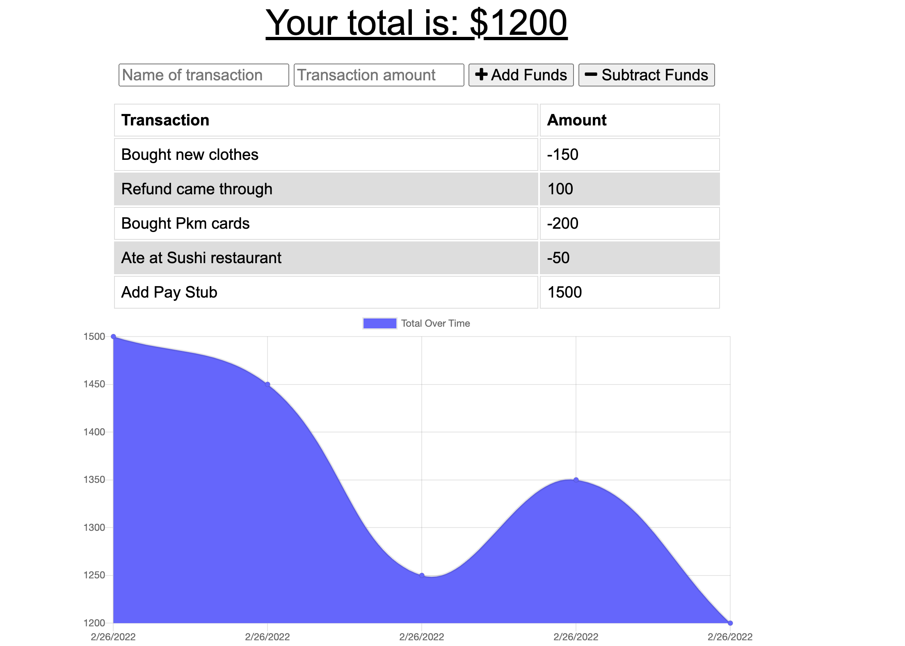

# Budget-Tracker

## Table of Contents

* [Description](#description)
* [Installation](#installation)
* [Usage](#usage)
* [Tests](#tests)

## Description

This assignment had me add offline functionality to an existing budget tracker application. It will allow users of the application to track their balance, even when they have no access to data/wifi.

## Installation

Clone the repository on to your device:

`https://github.com/Iviviana/Budget-Tracker.git`

Alternatively, [here's](https://github.com/Iviviana/Budget-Tracker.git) the link to the repository as well.

Once you have all the files, run `npm install` in the project directory to install all the dependencies from the `package.json`.

## Usage

Once you have installed the dependencies, you can run `npm start` or `node server.js` to start the server. 

The base port used is `localhost:3001`, you can change the port in the `server.js` file if you would rather use a different port.

Once the server is running, go to `localhost:{PORT}` and the budget tracker should be running. You will be able to add and deplete the amount of money available, even when you turn off the server, you will be able to spend or add money even offline.

## Tests

There are no tests available.

